 

### [⬇️&nbsp;&nbsp;Windows için indir](https://github.com/Fatal-IV/download-manager-releases/releases/latest/download/IndirmeYoneticisi_x64-setup.exe)

Tek tıkla en son sürümün kurulum dosyası iner · Türkçe kurulum · ~5 MB

 

<a href="https://github.com/Fatal-IV/download-manager-releases/releases/latest/download/IndirmeYoneticisi_x64-setup.exe"><b>Kurulum (.exe)</b></a>
&nbsp;·&nbsp;
<a href="https://github.com/Fatal-IV/download-manager-releases/releases/latest"><b>Sürüm notları</b></a>
&nbsp;·&nbsp;
<a href="https://github.com/Fatal-IV/download-manager-releases/releases"><b>Tüm sürümler</b></a>

---

## ✨ Nedir?

**İndirme Yöneticisi**, büyük dosyaları tek bir bağlantıya mahkûm kalmadan indirmeni sağlayan hafif bir Windows uygulamasıdır.
Dosyayı parçalara böler, parçaları aynı anda ayrı bağlantılarla indirir ve sonunda birleştirir. Cam efektli arayüzü; hız sınırı, zamanlayıcı ve otomatik güncelleme gibi günlük hayatı kolaylaştıran özelliklerle birlikte gelir.

 
Temsili animasyon: dosya parçalara bölünür, her parça kendi bağlantısıyla iner.

---

## 🚀 Özellikler

<table>
<tr>
<td width="50%" valign="top">

### ⚡ Hız
- **Parçalı indirme:** Dosya 1–32 parçaya bölünüp aynı anda iner
- **CDN'e dağıtma:** Bağlantılar sunucunun birden çok adresine paylaştırılır
- **Yansı (mirror) adresleri:** Aynı dosyayı birden çok kaynaktan çek
- **Hız testi:** Kaç bağlantının gerçekten işe yaradığını ölç
- **Akıllı geri çekilme:** Sunucu 429 verirse bağlantı sayısı kendiliğinden düşer

</td>
<td width="50%" valign="top">

### 🎛️ Denetim
- **Hız sınırı:** İnternetin başka işlere de kalsın
- **Zamanlayıcı:** İndirmeler yalnızca seçtiğin saat aralığında çalışsın (ör. gece 02:00–08:00)
- **Aynı anda indirme sınırı** ve otomatik **kuyruk**
- **Duraklat / sürdür**, kapatıp açsan da kaldığı yerden devam
- **Canlı hız grafiği** her indirmede

</td>
</tr>
<tr>
<td width="50%" valign="top">

### 🗂️ Düzen
- **Türüne göre otomatik klasör:** Video, Müzik, Görseller, Belgeler, Arşivler, Programlar
- **Arama, süzme ve sıralama:** ad, boyut, ilerleme, hız
- **Bitince bildirim:** Windows bildirimi ile haber alırsın
- **Açık ve koyu tema**

</td>
<td width="50%" valign="top">

### 🔄 Güvenilirlik
- **Ağ koparsa duraklar, gelince kendiliğinden devam eder**
- **Windows ile başlatma** ve **sistem tepsisinde çalışma**
- **Otomatik güncelleme:** yeni sürüm arka planda iner, sen "Yenile" dersin
- **Yenilikler penceresi:** güncelleme sonrası neyin değiştiğini görürsün
- Güncellemeler **imzalıdır**; doğrulanmayan paket kurulmaz

</td>
</tr>
</table>

---

## 📥 Kurulum

<table>
<tr>
<td align="center" width="33%">

**1 · İndir**

[**Kurulum dosyasını indir**](https://github.com/Fatal-IV/download-manager-releases/releases/latest/download/IndirmeYoneticisi_x64-setup.exe)

</td>
<td align="center" width="33%">

**2 · Kur**

`IndirmeYoneticisi_x64-setup.exe` dosyasını çalıştır. Kurulum Türkçedir ve yönetici izni gerektirmez.

</td>
<td align="center" width="33%">

**3 · Kullan**

Bağlantıyı yapıştır, **+** düğmesine bas. Gerisini uygulama halleder.

</td>
</tr>
</table>

> [!NOTE]
> Kurulum dosyası henüz bir kod imzalama sertifikasıyla imzalanmadığından Windows **SmartScreen** "Bilinmeyen yayıncı" uyarısı gösterebilir.
> Bu durumda **Ek bilgi → Yine de çalıştır** seçeneğini kullanabilirsin.

**Sistem gereksinimleri:** Windows 10 veya 11 (64 bit) · WebView2 (Windows 11'de hazır gelir).

**Güncelleme:** Uygulamayı bir kez kurman yeter. Sonraki sürümler otomatik gelir; istersen **Ayarlar → Güncellemeler → Güncellemeleri denetle** ile elle de bakabilirsin.

---

## ❓ Sık sorulanlar

<b>Parça sayısını artırmak her zaman hızlandırır mı?</b>

Hayır. Bazı sunucular tek bağlantıya hız sınırı koyar, bazıları ise bağlantı sayısına. Ayarlar'daki **hız testi**, senin bağlantın ve o sunucu için hangi sayının en iyi olduğunu ölçer.

<b>Pencereyi kapatınca indirmeler durur mu?</b>

Hayır. Pencereyi kapatmak uygulamayı sistem tepsisine indirir, indirmeler sürer. Tamamen çıkmak için tepsi simgesine sağ tıklayıp **Çık**'ı seç. Çıkarken yarım kalanlar bir sonraki açılışta kendiliğinden devam eder.

<b>Kaldığı yerden devam etme her sitede çalışır mı?</b>

Sunucu `Range` isteğini destekliyorsa evet. Desteklemiyorsa uygulama bunu fark eder ve o dosyayı tek bağlantıyla baştan indirir.

<b>Kaynak kod burada mı?</b>

Hayır. Bu depo yalnızca kurulum ve güncelleme dosyalarını (Releases) barındırır. Uygulama güncellemeleri buradan otomatik denetlenir.

---

Yapımcı: <a href="https://github.com/Fatal-IV">Fatal-IV</a> · Tauri, Rust ve React ile geliştirildi

